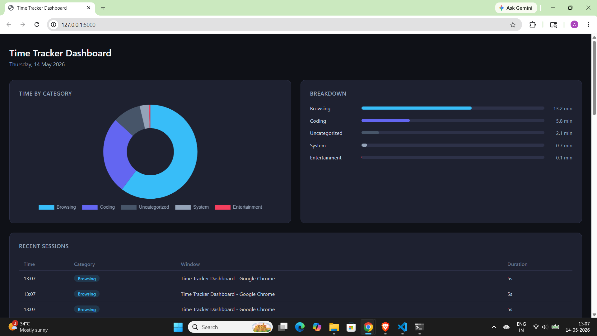

# Time Tracker

A Python desktop app that automatically tracks and categorizes how you spend your time on your PC — by reading active window titles every 5 seconds.

## Features

- Detects your active window every 5 seconds
- Auto-categorizes into: Coding, Browsing, Entertainment, Communication, Meeting, Documents
- Saves all sessions to a local SQLite database
- Generates a terminal report with a visual bar chart
- Web dashboard with a doughnut chart and session log (built with Flask + Chart.js)

## Tech Stack

- **Python** — core language
- **pygetwindow** — reads active window titles on Windows
- **SQLite** — local database for storing sessions
- **pandas** — data processing and report generation
- **Flask** — lightweight web server for the dashboard
- **Chart.js** — browser-side charts

## How to Run

### 1. Install dependencies
pip install pygetwindow flask pandas schedule

### 2. Start the tracker
python tracker.py

### 3. View the dashboard
python app.py
Then open http://127.0.0.1:5000 in your browser.

### 4. Generate a terminal report
python report.py

## Project Structure

```
time-tracker/
├── tracker.py        # Main tracker loop
├── categorizer.py    # Keyword-based categorization logic
├── database.py       # SQLite read/write functions
├── report.py         # Terminal summary report
├── app.py            # Flask web server
└── templates/
    └── dashboard.html  # Web dashboard UI
```

## Screenshots

